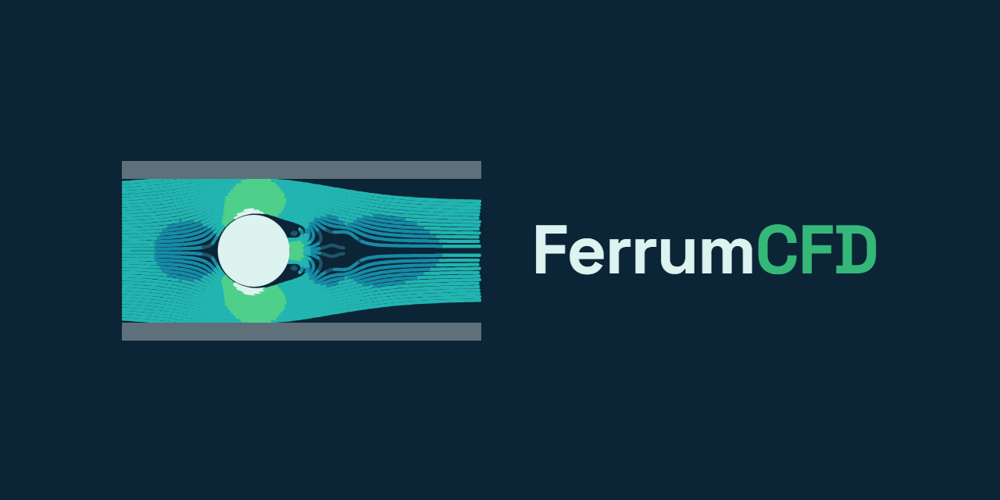

<p align="center">
  
</p>

<h1 align="center">FerrumCFD</h1>

<p align="center">
  Rust CFD program focused on native, backend-aware finite-volume solvers<br>
  and reproducible comparison with OpenFOAM 13 and analytical references.
</p>

---

**Current project version:** `0.1.0` (pre-stable).

FerrumCFD is an independent Rust project. OpenFOAM Foundation 13 is an optional
external interoperability and numerical-validation reference, not an
affiliated distribution or a FerrumCFD runtime dependency. Checked-in sibling
reference cases can be executed independently on a supported Linux system;
`ferrumRun` itself does not require an OpenFOAM executable.

The first executable application module is `incompressibleFluid`. Its current
CPU implementation covers steady laminar SIMPLE cases and has validation
bundles for a 3D circular pipe and a true 2D plane channel.

```text
ferrumRun -solver incompressibleFluid -case <case>
```

`incompressibleFluid` is the permanent public module name. Laminar flow is a
model regime, while SIMPLE, SIMPLEC, PISO, and PIMPLE are algorithms selected
by the case. There is no separate algorithm-named solver executable.

## Quick Start

The product requirement is a current Rust toolchain. PowerShell is optional
maintainer tooling for the scripts under `validation/`. Gmsh and a local
OpenFOAM 13 installation are optional and needed only to regenerate meshes or
external reference runs.

```powershell
cargo test --workspace

cargo run -p ferrum-cli --bin checkFerrumMesh -- `
  -case tutorials\incompressibleFluid\laminarPipe\ferrum\case

cargo run -p ferrum-run --bin ferrumRun -- `
  -solver incompressibleFluid `
  -case tutorials\incompressibleFluid\laminarPipe\ferrum\case `
  --preflight `
  --planJson target\ferrumRunPlan.json

cargo run -p ferrum-run --bin ferrumRun -- `
  -solver incompressibleFluid `
  -case tutorials\incompressibleFluid\laminarPipe\ferrum\case `
  --maxSimpleIterations 2
```

The `solver incompressibleFluid;` entry is already present in the curated
Ferrum cases, so `-solver incompressibleFluid` may be omitted there. Keeping it
in examples makes module selection explicit.

## Repository Layout

```text
applications/    public runners, runtime modules, and utilities
src/             reusable Rust mesh, finite-volume, I/O, and model libraries
tutorials/       independent Ferrum, OpenFOAM 13, and reference case bundles
validation/      comparison automation and stable validation contracts
test/            cross-package test contracts
docs/            user guide, architecture, roadmap, and benchmark reports
target/          generated build and validation artifacts
```

`ferrumRun` is the single-region runner. The planned `ferrumMultiRun` is the
coupled multi-region runner: one case, several regions, one module per region,
and a shared phase-oriented coupling loop. Its design includes CPU, GPU, mixed
CPU/GPU, and multi-GPU resource placement. It is intentionally not a batch or
parameter-sweep tool.

Both runners share one backend contract. After the selected steady and
transient incompressible SIMPLE/SIMPLEC/PISO/PIMPLE cases pass on the serial CPU
reference backend, `ferrumRun` advances through threaded CPU, distributed CPU,
single-GPU, and multi-GPU acceptance. `ferrumMultiRun` reuses those kernels for
coupled regions.

## Development With Codex

FerrumCFD's product direction, physics scope, performance objective, and
acceptance rules are set by project owner Marten Mehring. The main development
task initially used Codex with GPT-5.5. Its first recorded GPT-5.6 work occurred
on 2026-07-09; after a short model comparison that evening, the task continued
with GPT-5.6.

On 2026-07-16, the project owner initiated the current optimization phase and
required fixed-work, numerically controlled comparisons. Codex analyzed the
implementation, proposed bounded changes, implemented the approved Rust
optimizations, and added tests and measurement evidence. Codex Security is used
independently for repository and change-set security review. Optional residual
plotting is now native Rust SVG; Python and Matplotlib are not requirements.

The dated division of responsibilities, model transition, commits, measurement
rules, results, and publication status are recorded in the
[OpenAI Build Week 2026 development record](docs/build-week-2026.md).

## Documentation

- [User Guide](docs/user-guide.md)
- [Architecture](docs/architecture.md)
- [Solver Roadmap](docs/solver-roadmap.md)
- [Versioning And Releases](docs/versioning.md)
- [OpenAI Build Week 2026 Development Record](docs/build-week-2026.md)
- [Continuous Integration](docs/development/continuous-integration.md)
- [Validation Script Policy](docs/development/script-policy.md)
- [Benchmark Reports](docs/benchmarks)
- [Changelog](CHANGELOG.md)
- [Security Policy](SECURITY.md)

Local tutorial `README.md` files stay beside their cases because they describe
the Ferrum compatibility case, native OpenFOAM 13 case, and available reference. Project
manuals and design documents live under `docs/`. Standard repository metadata
(`LICENSE`, `CHANGELOG.md`, and `SECURITY.md`) remains at the root for GitHub
discovery.

## Developer Validation

PowerShell files under `validation/scripts/` are reproducibility and developer
tools, not public solver commands or a required tutorial workflow. Their scope
and retention policy is documented in
[`docs/development/script-policy.md`](docs/development/script-policy.md).
Generated meshes, fields, logs, plots, and reports belong below `target/`.

## License

FerrumCFD is licensed under the [MIT License](LICENSE).
External validation tools, compatibility formats, and tutorial provenance are
documented in [Third-party notices](THIRD_PARTY_NOTICES.md).
